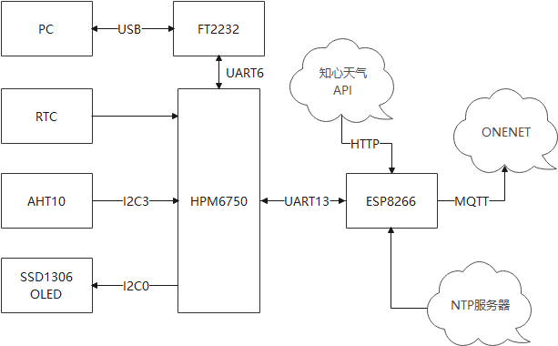
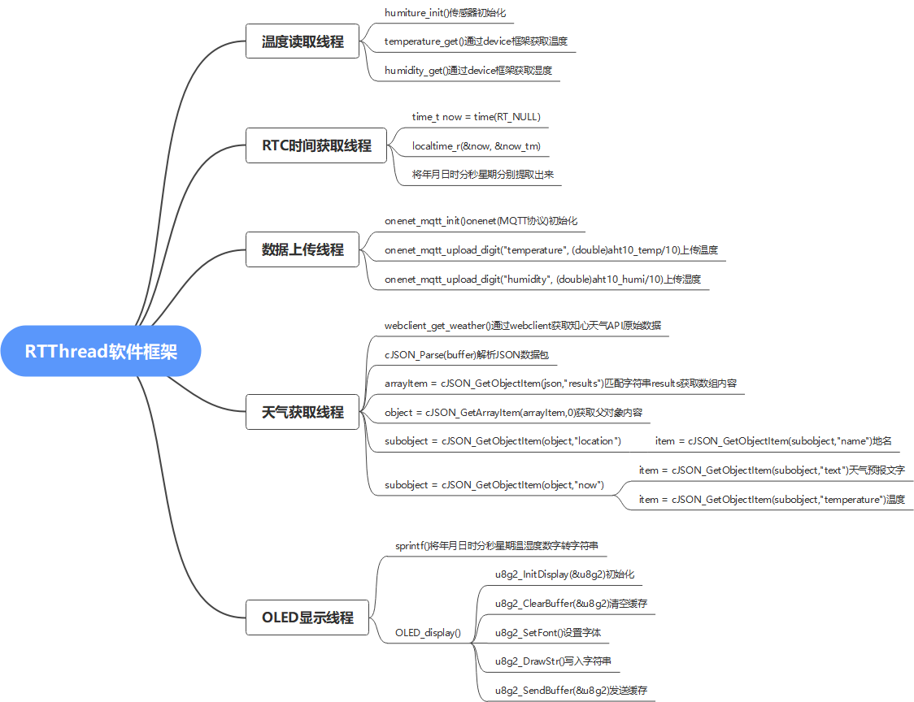
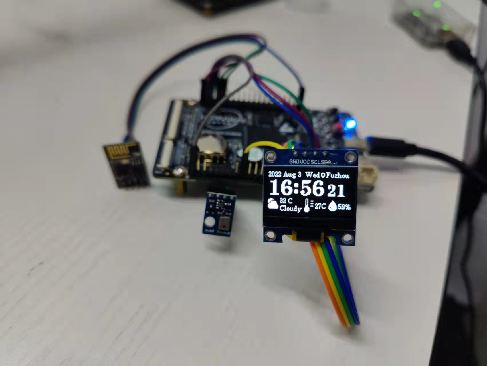

# RTThread Camp

# 桌面时钟

- ### 作品背景

  ​		正随着电子技术产业结构调整,生产工艺的飞速发展,人们生活水平的不断提高,家用电器逐渐普及,市场对于智能时钟控制系统的需求也越来越大。在如今智能化、网络化的社会中，时钟简单的记时、显示功能已不能满足新兴市场的需求。智能时钟能够通过联网与通信显示各种各样的内容。

- ### 实现功能

  - 日期与时间的显示,能够通过联网自动校准时间
  - 当前城市的天气情况显示,能够联网后自动获取并及时更新
  - 房间内的温湿度显示,能够将温湿度数据定时发送到云端

- ### RTThread使用情况

  本次设计系统共使用五个线程和一个互斥量

  添加了AT DEVICE软件包用于8266联网等操作

  添加了WebClient用于获取Http报文内容

  添加了cJSON软件包用于解析天气信息原始的json格式数据

  添加了Onenet软件包用于将温湿度信息发送上云

  添加了netutils软件包用于获取网络时间

  添加了aht10软件包用于通过传感器读取温湿度信息

  添加了u8g2软件包作为ssd1306 oled显示屏的显示驱动

- ### 硬件框架

  本次设计使用了HPM6750EVKMINI开发板，CPU为HPM6750，外部传感器使用AHT10采集环境温湿度，使用ESP8266连接室内WIFI获取时间与天气信息，然后通过SSD1306 OLED显示屏显示，此外采集到的温湿度信息也会通过WIFI网络上传到ONENET平台。

  

- ### 软件框架

  本次设计一共使用温湿度读取线程、RTC时间获取线程、天气获取线程、数据上传线程、OLED显示线程和一个互斥量用于RTC时间获取线程与OLED显示线程之间的同步(时间更新后及时显示)

  

  ```c
  int main(void)
  {
      sync_mux = rt_mutex_create("sync_mux", RT_IPC_FLAG_PRIO);
  
      realtime_thread = rt_thread_create("realtime",
                                         realtime_thread_entry,
                                         RT_NULL,
                                         2048,
                                         3,
                                         100);
      if (realtime_thread != RT_NULL)
          rt_thread_startup(realtime_thread);
  
      humiture_thread = rt_thread_create("humiture",
                                         humiture_thread_entry,
                                         RT_NULL,
                                         2048,
                                         7,
                                         100);
      if (humiture_thread != RT_NULL)
          rt_thread_startup(humiture_thread);
  
      onenet_thread = rt_thread_create("onenet",
                                        onenet_thread_entry,
                                        RT_NULL,
                                        2048,
                                        9,
                                        100);
      if (onenet_thread != RT_NULL)
          rt_thread_startup(onenet_thread);
  
      weather_thread = rt_thread_create("weather",
                                        weather_thread_entry,
                                        RT_NULL,
                                        2048,
                                        12,
                                        100);
      if (weather_thread != RT_NULL)
          rt_thread_startup(weather_thread);
  
      display_thread = rt_thread_create("display",
                                        display_thread_entry,
                                        RT_NULL,
                                        4096,
                                        5,
                                        100);
      if (display_thread != RT_NULL)
          rt_thread_startup(display_thread);
  
      return 0;
  }
  ```

  - ##### 温湿度读取线程

    线程开始先进行AHT10传感器的初始化，在while循环中通过编写的temperature_get(),humidity_get()函数读取温湿度，最后阻塞延时10s，即每10秒读取一次温湿度

    ```c
    void humiture_thread_entry(void *arg)
    {
        humiture_init();
        while(1)
        {
            aht10_temp = temperature_get();
            aht10_humi = humidity_get();
            rt_thread_mdelay(10000);
        }
    }
    ```

    其中temperature_get(),humidity_get()函数通过sensor框架find open read获取传感器数据

    ```c
    rt_uint32_t temperature_get(void)
    {
        struct rt_sensor_data data;
        _temp_dev = rt_device_find(TEMP_DEVICE_NAME);
        if(_temp_dev == RT_NULL)
            rt_kprintf("find %s device failed.\r\n", TEMP_DEVICE_NAME);
        else
            rt_device_open(_temp_dev, RT_DEVICE_FLAG_RDONLY);
    
        while(_temp_dev == RT_NULL);
        if (rt_device_read(_temp_dev, 0, &data, 1) == 1)
        	return (rt_uint32_t)data.data.temp;
    }
    
    rt_uint32_t humidity_get(void)
    {
        struct rt_sensor_data data;
        _humi_dev = rt_device_find(HUMI_DEVICE_NAME);
        if(_humi_dev == RT_NULL)
            rt_kprintf("find %s device failed.\r\n", HUMI_DEVICE_NAME);
        else
            rt_device_open(_humi_dev, RT_DEVICE_FLAG_RDONLY);
    
        while(_humi_dev == RT_NULL);
        if (rt_device_read(_humi_dev, 0, &data, 1) == 1)
        	return (rt_uint32_t)data.data.humi;
    }
    ```
    
  - ##### RTC时间获取线程

    该线程通过系统RTC功能获取当前的日期与时间信息，并将月份与星期匹配对应的英文缩写，同时while循环开始和结束分别获取和释放一个互斥量，实现与OLED显示线程之间的同步

    ```c
    void realtime_thread_entry(void *arg)
    {
        rt_uint8_t *days[] = {"Sun","Mon","Tue","Wed","Thu","Fri","Sat"};
        rt_uint8_t *months[] = {"Jan","Feb","Mar","Apr","May","Jun","Jul","Aug","Sep","Oct","Nov","Dec"};
        /* output current time */
        struct tm now_tm = {0};
        while(1)
        {
            rt_mutex_take(sync_mux, RT_WAITING_FOREVER);
    
            time_t now = time(RT_NULL);
            localtime_r(&now, &now_tm);
            RTC_year = 1900 + now_tm.tm_year;
            RTC_mon = months[now_tm.tm_mon];
            RTC_day = now_tm.tm_mday;
            RTC_hour = now_tm.tm_hour;
            RTC_min = now_tm.tm_min;
            RTC_sec = now_tm.tm_sec;
            RTC_week = days[now_tm.tm_wday];
    
            rt_mutex_release(sync_mux);
    
            rt_thread_mdelay(100);
        }
    }
    ```
  
  - ##### 数据上传线程

    该线程利用ONENET软件包(MQTT协议)中提供的onenet_mqtt_init()与onenet_mqtt_upload_digit()初始化与发送数据到ONENET。

    ```c
    void onenet_thread_entry(void *arg)
    {
        rt_thread_mdelay(10000);
        onenet_mqtt_init();
        while(1)
        {
            rt_thread_delay(rt_tick_from_millisecond(5 * 1000));
            onenet_mqtt_upload_digit("temperature", (double)aht10_temp/10);
            rt_thread_delay(rt_tick_from_millisecond(5 * 1000));
            onenet_mqtt_upload_digit("humidity", (double)aht10_humi/10);
            rt_thread_delay(50000);
        }
    }
    ```
  
  - ##### 天气获取线程

    webclient_get_weather()通过编写的天气获取函数通过知心天气API获取天气原始数据，其数据是JSON格式的，需通过解析JSON数据包，将其中的地点、天气和温度信息读取出来

    ```c
    void weather_thread_entry(void *arg)
    {
        rt_thread_mdelay(5000);
        rt_uint8_t *buffer;
        cJSON *json,*arrayItem,*object,*subobject,*item;
        rt_uint32_t size;
        while(1)
        {
            buffer = webclient_get_weather();
            json = cJSON_Parse(buffer);				//解析JSON数据包
            web_free(buffer);
            if(json == NULL)         				//检测JSON数据包是否存在语法上的错误，返回NULL表示数据包无效
            {
                rt_kprintf("Error before: [%s]\r\n",cJSON_GetErrorPtr()); 																									//打印数据包语法错误的位置
            }
            else
            {
                if((arrayItem = cJSON_GetObjectItem(json,"results")) != NULL); 																								//匹配字符串"results",获取数组内容
                {
                    size = cJSON_GetArraySize(arrayItem);     									//获取数组中对象个数
                    rt_kprintf("cJSON_GetArraySize: size=%d\n",size);
    
                    if((object = cJSON_GetArrayItem(arrayItem,0)) != NULL)						//获取父对象内容
                    {
                        if((subobject = cJSON_GetObjectItem(object,"location")) != NULL)
                        {
                            if((item = cJSON_GetObjectItem(subobject,"name")) != NULL) 			//地名--需要用到的数据
                            {
                                strcpy(location,item->valuestring);
                            }
                        }
                        if((subobject = cJSON_GetObjectItem(object,"now")) != NULL)
                        {
                            if((item = cJSON_GetObjectItem(subobject,"text")) != NULL)			//天气预报文字--需要用到的数据
                            {
                                strcpy(weather,item->valuestring);
    
                            }
                            if((item = cJSON_GetObjectItem(subobject,"temperature")) != NULL) 	//温度--需要用到的数据
                            {
                                strcpy(temperature,item->valuestring);
                            }
                        }
                        rt_kprintf("当前所在地区：%s  天气：%s  气温：%s°C\r\n",location,weather,temperature);
                    }
                }
            }
            cJSON_Delete(json);//释放cJSON_Parse()分配出来的内存空间
            rt_thread_mdelay(300000);
        }
    }
    ```
  
  - ##### OLED显示线程

    在线程中将其他线程读取到的温湿度、天气、日期、时间等数据通过sprintf函数转换成字符串，最后通过编写的OLED_display()函数调用u8g2软件包中的相关API将数据通过SSD1306 OLED显示出来

    ```c
    void display_thread_entry(void *arg)
    {
        rt_uint8_t temp[2],humi[2];
        rt_uint8_t hour[2],min[2],sec[2];
        rt_uint8_t date[15];
        while(1)
        {
            rt_mutex_take(sync_mux, RT_WAITING_FOREVER);
    
            if(RTC_day < 10) sprintf(date,"%d %s %d  %s",RTC_year,RTC_mon,RTC_day,RTC_week);
            else sprintf(date,"%d %s %d %s",RTC_year,RTC_mon,RTC_day,RTC_week);
    
            if(RTC_hour < 10) sprintf(hour,"0%d",RTC_hour);
            else sprintf(hour,"%d",RTC_hour);
            if(RTC_min < 10) sprintf(min,"0%d",RTC_min);
            else sprintf(min,"%d",RTC_min);
            if(RTC_sec < 10) sprintf(sec,"0%d",RTC_sec);
            else sprintf(sec,"%d",RTC_sec);
    
            sprintf(temp,"%dC",aht10_temp/10);
            sprintf(humi,"%d%%",aht10_humi/10);
    
            oled_display(date,hour,min,sec,temp,humi,location,weather,temperature);
    
            rt_mutex_release(sync_mux);
    
            rt_thread_mdelay(500);
        }
    }
    ```
  
- ### 完整作品图片

  