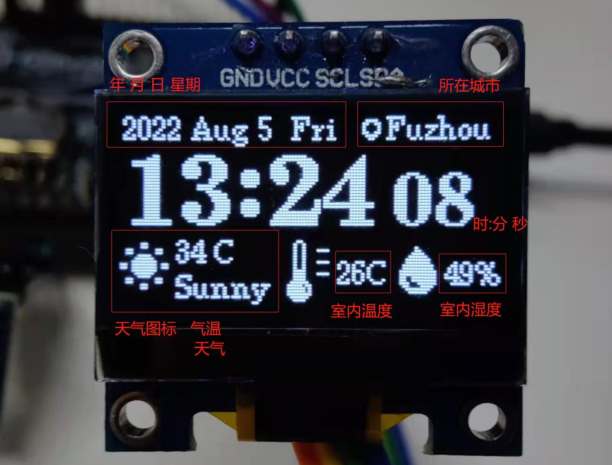
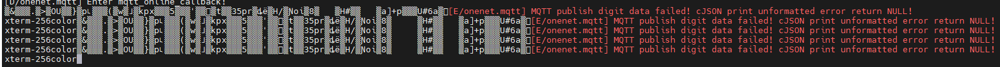

# RT-Thread 桌面时钟设计

**bilibili视频连接：https://www.bilibili.com/video/BV1fG4y1h7ij**


## 1、项目介绍

本次项目主要内容为桌面时钟的设计，其在普通时钟显示日期时间的基础上增加了联网与室内温湿度检测的功能，并且可以通过联网自动校准时间、获取和更新当地天气情况、定时将室内温湿度情况上传云端等功能。

成品外观如下，本次设计使用了HPM6750EVKMINI开发板，CPU为HPM6750，外部传感器使用AHT10采集环境温湿度，使用ESP8266连接室内WIFI获取时间与天气信息，然后通过SSD1306 OLED显示屏显示，此外采集到的温湿度信息也会通过WIFI网络上传到ONENET平台。


其中OLED左上角显示年 月 日 星期，右上角显示当前所在城市，左下角显示所在城市的天气情况，包括气温和天气，随着天气变化天气图标也会变为对应的天气，右下角显示的是室内温度和湿度，最后中间一行显示的就是时分秒。



## 2、前期准备

开发工具：RTThread Studio

相关SDK：RT-Thread Sourece Code 4.0.5、RISC-V-GCC 11.1.0、HPM6750-EVKM 0.5.0、OpenOCD-HPMirco 0.3.0

使用软件包：AHT10、u8g2(official)、cJSON、OneNET、AT DEVICE、netutils、WebClient

开发板：HPM6750EVKMINI

- MCU: HPM6750, 主频 816MHz, 2MBytes SRAM
- RGB LED灯
- 按键： 3, RESET, WBUTN, PBUTN
- 板载 16MB QSPI NOR 闪存，板载 16MB 16-bit SDRAM
- 调试接口: 板载FT2232
- 板载SPI WIFI: RW007
- 板载蜂鸣器

传感器与模块：ESP8266、AHT10、SSD1306 0.96 OLED

## 3、单个模块介绍

本次设计使用了ESP8266、AHT10、SSD1306 0.96 OLED这三个模块，本章节将分别介绍这三个模块的使用方法

### 3.1、AHT10介绍和使用

AHT10是一款高精度，完全校准，贴片封装的温湿度传感器，MEMS的制作工艺，确保产品具有极高的可靠性与卓越的长期稳定性。传感器包括一个电容式感湿元件和一个高性能CMOS微处理器相连接。该产品具有品质卓越、超快响应、抗干扰能力强、性价比极高等优点。

#### 3.1.1、底层i2c通信协议简介

I2C（Inter Integrated Circuit）总线是 PHILIPS 公司开发的一种半双工、双向二线制同步串行总线。I2C 总线传输数据时只需两根信号线，一根是双向数据线 SDA（serial data），另一根是双向时钟线 SCL（serial clock）。SPI 总线有两根线分别用于主从设备之间接收数据和发送数据，而 I2C 总线只使用一根线进行数据收发。

I2C 和 SPI 一样以主从的方式工作，不同于 SPI 一主多从的结构，它允许同时有多个主设备存在，每个连接到总线上的器件都有唯一的地址，主设备启动数据传输并产生时钟信号，从设备被主设备寻址，同一时刻只允许有一个主设备。如下图所示：


如下图所示为 I2C 总线主要的数据传输格式：


当总线空闲时，SDA 和 SCL 都处于高电平状态，当主机要和某个从机通讯时，会先发送一个开始条件，然后发送从机地址和读写控制位，接下来传输数据（主机发送或者接收数据），数据传输结束时主机会发送停止条件。传输的每个字节为8位，高位在前，低位在后。数据传输过程中的不同名词详解如下所示：

- **开始条件：** SCL 为高电平时，主机将 SDA 拉低，表示数据传输即将开始。
- **从机地址：** 主机发送的第一个字节为从机地址，高 7 位为地址，最低位为 R/W 读写控制位，1 表示读操作，0 表示写操作。一般从机地址有 7 位地址模式和 10 位地址模式两种，如果是 10 位地址模式，第一个字节的头 7 位 是 11110XX 的组合，其中最后两位（XX）是 10 位地址的两个最高位，第二个字节为 10 位从机地址的剩下8位，如下图所示：


- **应答信号：** 每传输完成一个字节的数据，接收方就需要回复一个 ACK（acknowledge）。写数据时由从机发送 ACK，读数据时由主机发送 ACK。当主机读到最后一个字节数据时，可发送 NACK（Not acknowledge）然后跟停止条件。
- **数据：** 从机地址发送完后可能会发送一些指令，依从机而定，然后开始传输数据，由主机或者从机发送，每个数据为 8 位，数据的字节数没有限制。
- **重复开始条件：** 在一次通信过程中，主机可能需要和不同的从机传输数据或者需要切换读写操作时，主机可以再发送一个开始条件。
- **停止条件：** 在 SDA 为低电平时，主机将 SCL 拉高并保持高电平，然后在将 SDA 拉高，表示传输结束。

#### 3.1.2、sensor框架的使用

应用程序通过 RT-Thread 提供的 I/O 设备管理接口来访问传感器设备，相关接口如下所示：

| **函数**                    | **描述**                                                     |
| --------------------------- | ------------------------------------------------------------ |
| rt_device_find()            | 应用程序根据传感器设备名称获取设备句柄，进而可以操作传感器设备 |
| rt_device_open()            | 通过设备句柄，应用程序可以打开和关闭设备，打开设备时，会检测设备是否已经初始化，没有初始化则会默认调用初始化接口初始化设备 |
| rt_device_read()            | 读取数据                                                     |
| rt_device_control()         | 通过命令控制字，应用程序可以对传感器设备进行配置             |
| rt_device_set_rx_indicate() | 设置接收回调函数，当传感器收到数据时，通知上层应用线程有数据到达 |
| rt_device_close()           | 当应用程序完成传感器操作后，通过该函数关闭传感器设备         |

#### 3.1.3、如何通过sensor框架读取温湿度数据

在使用sensor框架读取温湿度数据前，需要进行初始化的操作，设置使用的i2c接口、i2c设备地址，并且完成aht10温度传感器和湿度传感器设备注册。

```c
int humiture_init(void)
{
    struct rt_sensor_config cfg;
    cfg.intf.dev_name  = AHT10_I2C_BUS;						//设置i2c接口
    cfg.intf.user_data = (void *)AHT10_I2C_ADDR;			//设置i2c设备地址
    rt_hw_aht10_init("aht10", &cfg);						//注册进sensor框架
    return RT_EOK;
}
```

其中rt_hw_aht10_init函数源码为

```c
int rt_hw_aht10_init(const char *name, struct rt_sensor_config *cfg)
{
    rt_int8_t result;
    rt_sensor_t sensor_temp = RT_NULL, sensor_humi = RT_NULL;

#ifdef PKG_USING_AHT10

     /* temperature sensor register */
    sensor_temp = rt_calloc(1, sizeof(struct rt_sensor_device));
    if (sensor_temp == RT_NULL)
        return -1;

    sensor_temp->info.type       = RT_SENSOR_CLASS_TEMP;
    sensor_temp->info.vendor     = RT_SENSOR_VENDOR_UNKNOWN;
    sensor_temp->info.model      = "aht10";
    sensor_temp->info.unit       = RT_SENSOR_UNIT_DCELSIUS;
    sensor_temp->info.intf_type  = RT_SENSOR_INTF_I2C;
    sensor_temp->info.range_max  = SENSOR_TEMP_RANGE_MAX;
    sensor_temp->info.range_min  = SENSOR_TEMP_RANGE_MIN;
    sensor_temp->info.period_min = 5;

    rt_memcpy(&sensor_temp->config, cfg, sizeof(struct rt_sensor_config));
    sensor_temp->ops = &sensor_ops;

    result = rt_hw_sensor_register(sensor_temp, name, RT_DEVICE_FLAG_RDONLY, RT_NULL);
    if (result != RT_EOK)
    {
        LOG_E("device register err code: %d", result);
        goto __exit;
    }

    /* humidity sensor register */
    sensor_humi = rt_calloc(1, sizeof(struct rt_sensor_device));
    if (sensor_humi == RT_NULL)
        return -1;

    sensor_humi->info.type       = RT_SENSOR_CLASS_HUMI;
    sensor_humi->info.vendor     = RT_SENSOR_VENDOR_UNKNOWN;
    sensor_humi->info.model      = "aht10";
    sensor_humi->info.unit       = RT_SENSOR_UNIT_PERMILLAGE;
    sensor_humi->info.intf_type  = RT_SENSOR_INTF_I2C;
    sensor_humi->info.range_max  = SENSOR_HUMI_RANGE_MAX;
    sensor_humi->info.range_min  = SENSOR_HUMI_RANGE_MIN;
    sensor_humi->info.period_min = 5;

    rt_memcpy(&sensor_humi->config, cfg, sizeof(struct rt_sensor_config));
    sensor_humi->ops = &sensor_ops;

    result = rt_hw_sensor_register(sensor_humi, name, RT_DEVICE_FLAG_RDONLY, RT_NULL);
    if (result != RT_EOK)
    {
        LOG_E("device register err code: %d", result);
        goto __exit;
    }

#endif

    _aht10_init(&cfg->intf);
    return RT_EOK;

__exit:
    if (sensor_temp)
        rt_free(sensor_temp);
    if (sensor_humi)
        rt_free(sensor_humi);
    if (temp_humi_dev)
        aht10_deinit(temp_humi_dev);
    return -RT_ERROR;
}
```

初始化完成后即可利用sensor框架，按顺序使用rt_device_find()，rt_device_open()，rt_device_read()读取AHT10温湿度数据

```c
rt_uint32_t temperature_get(void)
{
    struct rt_sensor_data data;
    _temp_dev = rt_device_find(TEMP_DEVICE_NAME);
    if(_temp_dev == RT_NULL)
        rt_kprintf("find %s device failed.\r\n", TEMP_DEVICE_NAME);
    else
        rt_device_open(_temp_dev, RT_DEVICE_FLAG_RDONLY);

    while(_temp_dev == RT_NULL);
    if (rt_device_read(_temp_dev, 0, &data, 1) == 1)
    	return (rt_uint32_t)data.data.temp;
}

rt_uint32_t humidity_get(void)
{
    struct rt_sensor_data data;
    _humi_dev = rt_device_find(HUMI_DEVICE_NAME);
    if(_humi_dev == RT_NULL)
        rt_kprintf("find %s device failed.\r\n", HUMI_DEVICE_NAME);
    else
        rt_device_open(_humi_dev, RT_DEVICE_FLAG_RDONLY);

    while(_humi_dev == RT_NULL);
    if (rt_device_read(_humi_dev, 0, &data, 1) == 1)
        return (rt_uint32_t)data.data.humi;
}
```

### 3.2、ESP8266介绍和使用

ESP8266 Wi-Fi模块作为可以进行WiFi传输的模块集成了业内领先的Tensilica L106超低功耗32位微型MCU，带有16位精简模式，主频可达160MHz。同时支持RTOS（Real Time Operating System）集成Wi-Fi MAC/BB/RF/PA/LNA和 IEEE802.11 b/g/n 协议，支持完整的TCP/IP协议栈，也支持STA（Station），AP（Access Point），ATA+AP三种模式。

#### 3.2.1、底层usart简介

UART（Universal Asynchronous Receiver/Transmitter）通用异步收发传输器，UART 作为异步串口通信协议的一种，工作原理是将传输数据的每个字符一位接一位地传输。是在应用程序开发过程中使用频率最高的数据总线。

UART 串口的特点是将数据一位一位地顺序传送，只要 2 根传输线就可以实现双向通信，一根线发送数据的同时用另一根线接收数据。UART 串口通信有几个重要的参数，分别是波特率、起始位、数据位、停止位和奇偶检验位，对于两个使用 UART 串口通信的端口，这些参数必须匹配，否则通信将无法正常完成。UART 串口传输的数据格式如下图所示：


- 起始位：表示数据传输的开始，电平逻辑为 “0” 。
- 数据位：可能值有 5、6、7、8、9，表示传输这几个 bit 位数据。一般取值为 8，因为一个 ASCII 字符值为 8 位。
- 奇偶校验位：用于接收方对接收到的数据进行校验，校验 “1” 的位数为偶数(偶校验)或奇数(奇校验)，以此来校验数据传送的正确性，使用时不需要此位也可以。
- 停止位： 表示一帧数据的结束。电平逻辑为 “1”。
- 波特率：串口通信时的速率，它用单位时间内传输的二进制代码的有效位(bit)数来表示，其单位为每秒比特数 bit/s(bps)。常见的波特率值有 4800、9600、14400、38400、115200等，数值越大数据传输的越快，波特率为 115200 表示每秒钟传输 115200 位数据。

#### 3.2.2、MQTT通信协议介绍

MQTT（Message Queuing Telemetry Transport，消息队列遥测传输协议），是一种基于发布/订阅（publish/subscribe）模式的“轻量级”通讯协议，该协议构建于 TCP/IP 协议上，由 IBM 在 1999 年发布。

MQTT 最大优点在于，可以以极少的代码和有限的带宽，为连接远程设备提供实时可靠的消息服务。作为一种低开销、低带宽占用的即时通讯协议，使其在物联网、小型设备、移动应用等方面有较广泛的应用。

MQTT 是一个基于客户端-服务器的消息发布/订阅传输协议。MQTT 协议是轻量、简单、开放和易于实现的，这些特点使它适用范围非常广泛。在很多情况下，包括受限的环境中，如：机器与机器（M2M）通信和物联网（IoT）。其在，通过卫星链路通信传感器、偶尔拨号的医疗设备、智能家居、及一些小型化设备中已广泛使用。

#### 3.2.3、AT组件使用

- ##### AT命令

AT 命令（AT Commands）最早是由发明拨号调制解调器（MODEM）的贺氏公司（Hayes）为了控制 MODEM 而发明的控制协议。后来随着网络带宽的升级，速度很低的拨号 MODEM 基本退出一般使用市场，但是 AT 命令保留下来。当时主要的移动电话生产厂家共同为 GSM 研制了一整套 AT 命令，用于控制手机的 GSM 模块。AT 命令在此基础上演化并加入 GSM 07.05 标准以及后来的 GSM 07.07 标准，实现比较健全的标准化。

在随后的 GPRS 控制、3G 模块等方面，均采用的 AT 命令来控制，AT 命令逐渐在产品开发中成为实际的标准。如今，AT 命令也广泛的应用于嵌入式开发领域，AT 命令作为主芯片和通讯模块的协议接口，硬件接口一般为串口，这样主控设备可以通过简单的命令和硬件设计完成多种操作。

**AT 命令集是一种应用于 AT 服务器（AT Server）与 AT 客户端（AT Client）间的设备连接与数据通信的方式**。 其基本结构如下图所示：


1. 一般 AT 命令由三个部分组成，分别是：前缀、主体和结束符。其中前缀由字符 AT 构成；主体由命令、参数和可能用到的数据组成；结束符一般为 `<CR><LF>` (`"\r\n"`)。
2. AT 功能的实现需要 AT Server 和 AT Client 两个部分共同完成。
3. AT Server 主要用于接收 AT Client 发送的命令，判断接收的命令及参数格式，并下发对应的响应数据，或者主动下发数据。
4. AT Client 主要用于发送命令、等待 AT Server 响应，并对 AT Server 响应数据或主动发送的数据进行解析处理，获取相关信息。
5. AT Server 和 AT Client 之间支持多种数据通讯的方式（UART、SPI 等），目前最常用的是串口 UART 通讯方式。
6. AT Server 向 AT Client 发送的数据分成两种：响应数据和 URC 数据。

- 响应数据： AT Client 发送命令之后收到的 AT Server 响应状态和信息。
- URC 数据： AT Server 主动发送给 AT Client 的数据，一般出现在一些特殊的情况，比如 WIFI 连接断开、TCP 接收数据等，这些情况往往需要用户做出相应操作。

随着 AT 命令的逐渐普及，越来越多的嵌入式产品上使用了 AT 命令，AT 命令作为主芯片和通讯模块的协议接口，硬件接口一般为串口，这样主控设备可以通过简单的命令和硬件设计完成多种操作。

虽然 AT 命令已经形成了一定的标准化，但是不同的芯片支持的 AT 命令并没有完全统一，这直接提高了用户使用的复杂性。对于 AT 命令的发送和接收以及数据的解析没有统一的处理方式。并且在使用 AT 设备连接网络时，只能通过命令完成简单的设备连接和数据收发功能，很难做到对上层网络应用接口的适配，不利于产品设备的开发。

为了方便用户使用 AT 命令，简单的适配不同的 AT 模块， RT-Thread 提供了 AT 组件用于 AT 设备的连接和数据通讯。AT 组件的实现包括客户端的和服务器两部分。

- ##### AT组件

AT 组件是基于 RT-Thread 系统的 `AT Server` 和 `AT Client` 的实现，组件完成 AT 命令的发送、命令格式及参数判断、命令的响应、响应数据的接收、响应数据的解析、URC 数据处理等整个 AT 命令数据交互流程。

通过 AT 组件，设备可以作为 AT Client 使用串口连接其他设备发送并接收解析数据，可以作为 AT Server 让其他设备甚至电脑端连接完成发送数据的响应，也可以在本地 shell 启动 CLI 模式使设备同时支持 AT Server 和 AT Client 功能，该模式多用于设备开发调试。

**AT 组件资源占用：**

- AT Client 功能：4.6K ROM 和 2.0K RAM；
- AT Server 功能：4.0K ROM 和 2.5K RAM；
- AT CLI 功能： 1.5K ROM ，几乎没有使用 RAM。

整体看来，AT 组件资源占用极小，因此非常适用应用于资源有限的嵌入式设备中。AT 组件代码主要位于 `rt-thread/components/net/at/` 目录中。主要的功能包括如下，

**AT Server 主要功能特点：**

- 基础命令： 实现多种通用基础命令（ATE、ATZ 等）；
- 命令兼容： 命令支持忽略大小写，提高命令兼容性；
- 命令检测： 命令支持自定义参数表达式，并实现对接收的命令参数自检测功能；
- 命令注册： 提供简单的用户自定义命令添加方式，类似于 `finsh/msh` 命令添加方式；
- 调试模式： 提供 AT Server CLI 命令行交互模式，主要用于设备调试。

**AT Client 主要功能特点：**

- URC 数据处理： 完备的 URC 数据的处理方式；
- 数据解析： 支持自定义响应数据的解析方式，方便获取响应数据中相关信息；
- 调试模式： 提供 AT Client CLI 命令行交互模式，主要用于设备调试。
- AT Socket：作为 AT Client 功能的延伸，使用 AT 命令收发作为基础，实现标准的 BSD Socket API，完成数据的收发功能，使用户通过 AT 命令完成设备连网和数据通讯。
- 多客户端支持： AT 组件目前支持多客户端同时运行。

#### 3.2.4、实现ESP8266连接WIFI

ESP8266连接WIFI是通过AT命令支持实现的，RTThread提供的AT软件包包含ESP8266的相关API，这里我们只需要添加AT软件包，并勾选ESP8266即可

相关设置如下，开启后将需要连接的wifi名、wifi密码和8266使用的串口填入设置中，并开启线程中初始化和8266 at socket即可


同时因为8266连接网络是通过AT命令支持的，所以也需要在组件中开启AT命令功能，设置如下，这里我们开启AT命令客户端


设置完成后编译上机，通过终端可以观察到WIFI连接情况


#### 3.2.5、实时时间如何获取

RTThread提供了netutils软件包供添加使用，RT-Thread NetUtils 作为网络工具合集，既有用于测试调试的 Ping 命令， 同步时间的 NTP 工具， 性能和带宽测试的 Iperf 、 NetIO，还有在嵌入式系统中广泛使用的轻量级文件传输工具 TFTP，方便地通过网络完成两个设备间的文件互传。另外， RT-Thread 还针对开发中的实际问题，提供了一些高级的辅助工具，如可以远程登录到 RT-Thread Finsh/MSH Shell 的 Telnet 工具，以及基于 lwIP 的网络抓包工具 tcpdump。

这里我们只需要添加netutils软件包，并开启NTP功能

相关设置如下，默认提供了三个NTP服务器供访问，并且还提供了NTP自动同步RTC功能，这里选择开启，并且设置首次同步延时为5秒(等待ESP8266连接网络)，同时每一小时同步一次。


设置完成后上，上机待ESP8266连接网络后，即可自动同步实时时间


#### 3.2.6、当地天气如何获取

获取网络天气，首先我们需要一个网络天气API端口供我们访问

这里我选择的是知心天气API

登录其网站完成注册，并选择免费版产品创建，创建完成后可获得该账户密钥


然后将密钥填入知心天气提供的API中，替换`your_private_key`，此外`beijing`替换成当前所在城市，`zh-Hans`可替换成需要显示的语言，`zh-Hans`是简体中文`zh-Hant`是繁体中文`en`是英文，本次设计中因为u8g2显示中文存在一些问题，所以选择英语显示。`https://api.seniverse.com/v3/weather/now.jsonkey=your_private_key&location=beijing&language=zh-Hans&unit=c`

得到自己的API后，因为知心天气API是HTTP报文格式，这里使用WebClient软件包，编写函数获取HTTP报文数据，其中`GET_LOCAL_URI`宏对应自己的知心天气API。

```c
#include <rtthread.h>
#include <webclient.h>
#include "cJSON.h"

#define GET_HEADER_BUFSZ               1024
#define GET_RESP_BUFSZ                 1024

#define GET_LOCAL_URI                  "http://api.seniverse.com/v3/weather/now.json？key=your_private_key&location=beijing&language=zh-Hans&unit=c"

static unsigned char* webclient_get_comm(const char *uri);
unsigned char* webclient_get_weather();

static unsigned char* webclient_get_comm(const char *uri)
{
    struct webclient_session* session = RT_NULL;
    unsigned char *buffer = RT_NULL;
    int index, ret = 0;
    int bytes_read, resp_status;
    int content_length = -1;

    buffer = (unsigned char *) web_malloc(GET_RESP_BUFSZ);
    if (buffer == RT_NULL)
    {
        rt_kprintf("no memory for receive buffer.\n");
        ret = -RT_ENOMEM;
        goto __exit;

    }

    /* create webclient session and set header response size */
    session = webclient_session_create(GET_HEADER_BUFSZ);
    if (session == RT_NULL)
    {
        ret = -RT_ENOMEM;
        goto __exit;
    }

    /* send GET request by default header */
    if ((resp_status = webclient_get(session, uri)) != 200)
    {
        rt_kprintf("webclient GET request failed, response(%d) error.\n", resp_status);
        ret = -RT_ERROR;
        goto __exit;
    }

    rt_kprintf("webclient get response data: \n");

    content_length = webclient_content_length_get(session);
    if (content_length < 0)
    {
        rt_kprintf("webclient GET request type is chunked.\n");
        do
        {
            bytes_read = webclient_read(session, (void *)buffer, GET_RESP_BUFSZ);
            if (bytes_read <= 0)
            {
                break;
            }

            for (index = 0; index < bytes_read; index++)
            {
                rt_kprintf("%c", buffer[index]);
            }
        } while (1);

        rt_kprintf("\n");
    }
    else
    {
        int content_pos = 0;

        do
        {
            bytes_read = webclient_read(session, (void *)buffer,
                    content_length - content_pos > GET_RESP_BUFSZ ?
                            GET_RESP_BUFSZ : content_length - content_pos);
            if (bytes_read <= 0)
            {
                break;
            }

            for (index = 0; index < bytes_read; index++)
            {
                rt_kprintf("%c", buffer[index]);
            }

            rt_kprintf("\r\n");
//            cJSON_NowWeatherParse(buffer);

            content_pos += bytes_read;
        } while (content_pos < content_length);

        rt_kprintf("\n");
    }
__exit:
    if (session)
    {
        webclient_close(session);
    }
    if (buffer)
    {
        return buffer;
    }

}


unsigned char* webclient_get_weather()
{
    char *uri = RT_NULL;
    unsigned char *buffer = RT_NULL;

    uri = web_strdup(GET_LOCAL_URI);
    if(uri == RT_NULL)
    {
        rt_kprintf("no memory for create get request uri buffer.\n");
    }

    buffer = webclient_get_comm(uri);

    if (uri)
    {
        web_free(uri);
    }

    return buffer;
}
```

此步骤结束，上机编译测试，可发现最后读取到的数据是一个以JSON为格式的字符串，天气、城市、气温等数据都包含其中，还不能直接使用 ，需要利用cJSON软件包解析


添加cJSON软件包，并且包含`cJSON.h`头文件，利用相关API编写函数，传入JSON格式字符串，并解析JSON数据包，从中提取出本次设计需要的天气、气温、城市信息

```c
static int cJSON_NowWeatherParse(char *JSON)
{
    cJSON *json,*arrayItem,*object,*subobject,*item;
    int size;
    char *location,*weather,*temperature;
    json = cJSON_Parse(JSON);														//解析JSON数据包
        if(json == NULL)          													//检测JSON数据包是否存在语法上的错误，返回NULL表示数据包无效
        {
            rt_kprintf("Error before: [%s]\r\n",cJSON_GetErrorPtr()); 				//打印数据包语法错误的位置
            return -RT_ERROR;
        }
        else
        {
            if((arrayItem = cJSON_GetObjectItem(json,"results")) != NULL); 			//匹配字符串"results",获取数组内容
            {
                size = cJSON_GetArraySize(arrayItem);     							//获取数组中对象个数
                rt_kprintf("cJSON_GetArraySize: size=%d\n",size);

                if((object = cJSON_GetArrayItem(arrayItem,0)) != NULL)				//获取父对象内容
                {
                    if((subobject = cJSON_GetObjectItem(object,"location")) != NULL)
                    {
                        if((item = cJSON_GetObjectItem(subobject,"name")) != NULL) 	//地名--需要用到的数据
                        {
                            location = item->valuestring;
                        }
                    }
                    if((subobject = cJSON_GetObjectItem(object,"now")) != NULL)
                    {
                        if((item = cJSON_GetObjectItem(subobject,"text")) != NULL)	//天气预报文字--需要用到的数据
                        {
                            weather = item->valuestring;

                        }
                        if((item = cJSON_GetObjectItem(subobject,"temperature")) != NULL) //温度--需要用到的数据
                        {
                            temperature = item->valuestring;
                        }
                    }
                    rt_kprintf("当前所在地区：%s  天气：%s  气温：%s°C\r\n",location,weather,temperature);
                }
            }
        }
        cJSON_Delete(json); //释放cJSON_Parse()分配出来的内存空间
        return RT_EOK;
}
```

完成后，编译上机测试，此时已经可以正常显示出当前所在地区、天气和气温信息


#### 3.2.7、数据如何上传云端

本次设计采用OneNET云

首先进入ONENET官网注册账号

账号注册登录成功后，点击控制台进入管理界面；

点击多协议接入，创建一个产品，其中接入协议选择MQTT协议；


创建好产品后，进入产品中添加一个新设备，其中鉴权信息与之后RT-Thread Setting中的身份验证信息相对应，可用密码生成器随机生成


设备创建完成后进入详情，创建APIKey，到这设备的创建就完成了

设备创建完成后，返回RT-thread Studio进入RT-Thread Setting，添加本次使用的OneNET软件包

然后将产品与设备相关信息填入RT-Thread Setting的OneNET设置中


设置完成后上机测试

使用onenet_mqtt_init初始化，连接onenet


查看ONENET看设备是否正常连接


通过onenet_unload_cycle测试设备发送信息到ONENET


也可以通过onenet_mqtt_publish_string发送特定字符到ONENET和onenet_mqtt_publish_digit发送指定数值到ONENET


在后续开发中若不使用msh命令初始化和发送数据，可添加`onenet.h`头文件，调用`onenet_mqtt_init()`函数用于初始化，调用 `onenet_mqtt_upload_digit()`函数上传数值，调用`onenet_mqtt_upload_string()`函数上传字符串

### 3.3、SSD1306 OLED屏的介绍和使用

#### 3.3.1、SSD1306 OLED屏介绍

①0.96寸OLED屏，支持黑白、黑蓝或者黄蓝双色显示

②128x64分辨率，显示效果清晰，对比度高

③超大可视角度:大于160°(显示屏中可视角度最大的一种屏幕)

④宽电压供电（3V~5V），兼容3.3V和5V逻辑电平，无需电平转换芯片

⑤通信方式：4线SPI，3线SPI、IIC总线

⑥驱动芯片：SSD1306

SSD1306是一款带控制器的用于OLED点阵图形显示系统的单片CMOS OLED/PLED驱动器。它由128个SEG（列输出）和64个COM（行输出）组成。该芯片专为共阴极OLED面板设计。
SSD1306内置对比度控制器、显示RAM（GDDRAM）和振荡器，以此减少了外部元件的数量和功耗。该芯片有256级亮度控制。数据或命令由通用微控制器通过硬件选择的6800/8000系通用并行接口、I2C接口或串行外围接口发送。该芯片适用于许多小型便携式应用，如手机副显示屏、MP3播放器和计算器等。

#### 3.3.2、u8g2库介绍

U8g2库是嵌入式设备单色图形库，支持非常多的嵌入式设备平台，如单片机，STM32，Arduino等，支持大多数主流的单色OLED和LCD显示控制器，如我们常见的SSD1306。其包括了多种图形的布局，支持多种字体。

ssd1306 128*64分辨率 OLED i2c例程如下，使用时将`OLED_I2C_PIN_SCL`和`OLED_I2C_PIN_SDA`两个宏替换成实际接OLED SCL和SDA的引脚号

```c
#include <rthw.h>
#include <rtthread.h>
#include <rtdevice.h>
#include <u8g2_port.h>

#define OLED_I2C_PIN_SCL                    22  // PB6
#define OLED_I2C_PIN_SDA                    23  // PB7

static void u8g2_ssd1306_12864_sw_i2c_example(int argc,char *argv[])
{
    u8g2_t u8g2;

    // Initialization
    u8g2_Setup_ssd1306_i2c_128x64_noname_f( &u8g2, U8G2_R0, u8x8_byte_sw_i2c, u8x8_gpio_and_delay_rtthread);
    u8x8_SetPin(u8g2_GetU8x8(&u8g2), U8X8_PIN_I2C_CLOCK, OLED_I2C_PIN_SCL);
    u8x8_SetPin(u8g2_GetU8x8(&u8g2), U8X8_PIN_I2C_DATA, OLED_I2C_PIN_SDA);    

    u8g2_InitDisplay(&u8g2);
    u8g2_SetPowerSave(&u8g2, 0);

    // Draw Graphics
    /* full buffer example, setup procedure ends in _f */
    u8g2_ClearBuffer(&u8g2);
    u8g2_SetFont(&u8g2, u8g2_font_ncenB08_tr);
    u8g2_DrawStr(&u8g2, 1, 18, "U8g2 on RT-Thread");
    u8g2_SendBuffer(&u8g2);

    u8g2_SetFont(&u8g2, u8g2_font_unifont_t_symbols);
    u8g2_DrawGlyph(&u8g2, 112, 56, 0x2603 );
    u8g2_SendBuffer(&u8g2);
}
```

初始化完成后 `u8g2_ClearBuffer(&u8g2)`函数用于清空缓存，`u8g2_SetFont(&u8g2, u8g2_font_ncenB08_tr)`用于设置字体或是图集， `u8g2_DrawStr(&u8g2, 1, 18, "U8g2 on RT-Thread")`用于写入字符串，`u8g2_DrawGlyph(&u8g2, 112, 56, 0x2603 )`用于写入图集对应图标，`u8g2_SendBuffer(&u8g2)`用于将缓存发送给OLED显示

#### 3.3.3、ui设计

本次OLED的UI设计如下


其中使用了u8g2库中自带的u8g2_font_open_iconic_all_2x_t图集和u8g2_font_streamline_weather_t图集


实现代码如下

```c
void oled_display(char *date,char *hour,char *min,char *sec,char *temp,char *humi,char *location,char *weather,char *temperature)
{
    u8g2_t u8g2;
    // Initialization
    u8g2_Setup_ssd1306_i2c_128x64_noname_f( &u8g2, U8G2_R0, u8x8_byte_sw_i2c, u8x8_gpio_and_delay_rtthread);
    u8x8_SetPin(u8g2_GetU8x8(&u8g2), U8X8_PIN_I2C_CLOCK, OLED_I2C_PIN_SCL);
    u8x8_SetPin(u8g2_GetU8x8(&u8g2), U8X8_PIN_I2C_DATA, OLED_I2C_PIN_SDA);

    u8g2_InitDisplay(&u8g2);
    u8g2_SetPowerSave(&u8g2, 0);

    // Draw Graphics
    /* full buffer example, setup procedure ends in _f */
    u8g2_ClearBuffer(&u8g2);
    u8g2_SetFont(&u8g2, u8g2_font_ncenR08_tr);
    u8g2_DrawStr(&u8g2, 1, 8, date);

    u8g2_SetFont(&u8g2, u8g2_font_open_iconic_www_1x_t);
    u8g2_DrawGlyph(&u8g2, 81, 9, 0x0047 );
    u8g2_SetFont(&u8g2, u8g2_font_ncenR08_tr);
    u8g2_DrawStr(&u8g2, 90, 8, location);
//    rt_kprintf(location);

    u8g2_SetFont(&u8g2, u8g2_font_ncenB24_tr);
    u8g2_DrawStr(&u8g2, 1, 37, hour);
    u8g2_DrawStr(&u8g2, 39, 34, ":");
    u8g2_DrawStr(&u8g2, 50, 37, min);
    u8g2_SetFont(&u8g2, u8g2_font_ncenB18_tr);
    u8g2_DrawStr(&u8g2, 92, 37, sec);

    u8g2_SetFont(&u8g2, u8g2_font_open_iconic_all_2x_t);
    if(check_sunny == 0){
        u8g2_DrawGlyph(&u8g2, 0, 59, 0x0103 );
        u8g2_SetFont(&u8g2, u8g2_font_ncenR08_tr);
        u8g2_DrawStr(&u8g2, 19, 62, weather);}
    else if(check_clear == 0){
        u8g2_DrawGlyph(&u8g2, 0, 59, 0x00df );
        u8g2_SetFont(&u8g2, u8g2_font_ncenR08_tr);
        u8g2_DrawStr(&u8g2, 19, 62, weather);}
    else if(check_overcast != 0){
        u8g2_DrawGlyph(&u8g2, 0, 59, 0x007c );
        u8g2_SetFont(&u8g2, u8g2_font_timR08_tf);
        u8g2_DrawStr(&u8g2, 19, 62, "Overcast");}
    else if(check_thunder == 0){
        u8g2_DrawGlyph(&u8g2, 2, 60, 0x0060 );
        u8g2_SetFont(&u8g2, u8g2_font_timR08_tf);
        u8g2_DrawStr(&u8g2, 19, 62, "Thunder");}
    else if(check_cloudy == 0){
        u8g2_DrawGlyph(&u8g2, 0, 59, 0x007f );
        u8g2_SetFont(&u8g2, u8g2_font_ncenR08_tr);
        u8g2_DrawStr(&u8g2, 19, 62, "Cloudy");}
    else if(check_rainy == 0){
        u8g2_DrawGlyph(&u8g2, 0, 59, 0x00f1 );
        u8g2_SetFont(&u8g2, u8g2_font_ncenR08_tr);
        u8g2_DrawStr(&u8g2, 19, 62, "Rainy");}
    else if(check_snowy == 0){
        u8g2_DrawGlyph(&u8g2, 0, 59, 0x0081 );
        u8g2_SetFont(&u8g2, u8g2_font_ncenR08_tr);
        u8g2_DrawStr(&u8g2, 19, 62, "Snowy");}
    else{
        u8g2_DrawGlyph(&u8g2, 0, 59, 0x00cf );
        u8g2_SetFont(&u8g2, u8g2_font_timR08_tf);
        u8g2_DrawStr(&u8g2, 19, 62, weather);}

    u8g2_SetFont(&u8g2, u8g2_font_ncenR08_tr);
    u8g2_DrawStr(&u8g2, 19, 50, temperature);
    u8g2_DrawStr(&u8g2, 29, 50, " C");

    u8g2_SetFont(&u8g2, u8g2_font_streamline_weather_t);
    u8g2_DrawGlyph(&u8g2, 54, 63, 0x0036 );
    u8g2_SetFont(&u8g2, u8g2_font_ncenR08_tr);
    u8g2_DrawStr(&u8g2, 74, 57,  temp);

    u8g2_SetFont(&u8g2, u8g2_font_open_iconic_thing_2x_t);
    u8g2_DrawGlyph(&u8g2, 93, 60, 0x0048 );
    u8g2_SetFont(&u8g2, u8g2_font_ncenR08_tr);
    u8g2_DrawStr(&u8g2, 110, 57, humi);

    u8g2_SendBuffer(&u8g2);

}
```

## 4、整体代码框架

### 4.1、如何为多个任务分配线程

本次设计按照各自实现的功能不同，一共使用温湿度读取线程、RTC时间获取线程、天气获取线程、数据上传线程、OLED显示线程这五个线程。

温湿度读取线程、RTC时间获取线程、天气获取线程分别读取或获取各自说需要获取的数据

数据获取后通过OLED显示线程将数据按照设计UI显示出来，通过数据上传线程将温湿度数值上传到OneNET云


```c
int main(void)
{
    sync_mux = rt_mutex_create("sync_mux", RT_IPC_FLAG_PRIO);

    realtime_thread = rt_thread_create("realtime",
                                       realtime_thread_entry,
                                       RT_NULL,
                                       2048,
                                       3,
                                       100);
    if (realtime_thread != RT_NULL)
        rt_thread_startup(realtime_thread);

    humiture_thread = rt_thread_create("humiture",
                                       humiture_thread_entry,
                                       RT_NULL,
                                       2048,
                                       7,
                                       100);
    if (humiture_thread != RT_NULL)
        rt_thread_startup(humiture_thread);

    onenet_thread = rt_thread_create("onenet",
                                      onenet_thread_entry,
                                      RT_NULL,
                                      2048,
                                      9,
                                      100);
    if (onenet_thread != RT_NULL)
        rt_thread_startup(onenet_thread);

    weather_thread = rt_thread_create("weather",
                                      weather_thread_entry,
                                      RT_NULL,
                                      2048,
                                      12,
                                      100);
    if (weather_thread != RT_NULL)
        rt_thread_startup(weather_thread);

    display_thread = rt_thread_create("display",
                                      display_thread_entry,
                                      RT_NULL,
                                      4096,
                                      5,
                                      100);
    if (display_thread != RT_NULL)
        rt_thread_startup(display_thread);

    return 0;
}
```


### 4.2、如何实现线程间的交互（ipc）

在本次设计中使用了一个互斥量用于RTC时间获取线程与OLED显示线程之间的同步，保证时间更新后能立刻切换到OLED显示线程完成显示

### 4.3、代码整合（逻辑实现）

- ##### 温湿度读取线程

  线程开始先进行AHT10传感器的初始化，在while循环中通过编写的temperature_get(),humidity_get()函数读取温湿度，最后阻塞延时10s，即每10秒读取一次温湿度

  ```c
  void humiture_thread_entry(void *arg)
  {
      humiture_init();
      while(1)
      {
          aht10_temp = temperature_get();
          aht10_humi = humidity_get();
          rt_thread_mdelay(10000);
      }
  }
  ```

  其中temperature_get(),humidity_get()函数见3.1.3节

- ##### RTC时间获取线程

  该线程通过系统RTC功能获取当前的日期与时间信息，并将月份与星期匹配对应的英文缩写，同时while循环开始和结束分别获取和释放一个互斥量，实现与OLED显示线程之间的同步

  ```c
  void realtime_thread_entry(void *arg)
  {
      rt_uint8_t *days[] = {"Sun","Mon","Tue","Wed","Thu","Fri","Sat"};
      rt_uint8_t *months[] = {"Jan","Feb","Mar","Apr","May","Jun","Jul","Aug","Sep","Oct","Nov","Dec"};
      /* output current time */
      struct tm now_tm = {0};
      while(1)
      {
          rt_mutex_take(sync_mux, RT_WAITING_FOREVER);
  
          time_t now = time(RT_NULL);
          localtime_r(&now, &now_tm);
          RTC_year = 1900 + now_tm.tm_year;
          RTC_mon = months[now_tm.tm_mon];
          RTC_day = now_tm.tm_mday;
          RTC_hour = now_tm.tm_hour;
          RTC_min = now_tm.tm_min;
          RTC_sec = now_tm.tm_sec;
          RTC_week = days[now_tm.tm_wday];
  
          rt_mutex_release(sync_mux);
  
          rt_thread_mdelay(100);
      }
  }
  ```

- ##### 数据上传线程

  该线程利用ONENET软件包(MQTT协议)中提供的onenet_mqtt_init()与onenet_mqtt_upload_digit()初始化与发送数据到ONENET。

  ```c
  void onenet_thread_entry(void *arg)
  {
      rt_thread_mdelay(10000);
      onenet_mqtt_init();
      while(1)
      {
          rt_thread_delay(rt_tick_from_millisecond(5 * 1000));
          onenet_mqtt_upload_digit("temperature", (double)aht10_temp/10);
          rt_thread_delay(rt_tick_from_millisecond(5 * 1000));
          onenet_mqtt_upload_digit("humidity", (double)aht10_humi/10);
          rt_thread_delay(50000);
      }
  }
  ```

- ##### 天气获取线程

  webclient_get_weather()通过编写的天气获取函数通过知心天气API获取天气原始数据，其数据是JSON格式的，需通过解析JSON数据包，将其中的地点、天气和温度信息读取出来

  ```c
  void weather_thread_entry(void *arg)
  {
      rt_thread_mdelay(5000);
      rt_uint8_t *buffer;
      cJSON *json,*arrayItem,*object,*subobject,*item;
      rt_uint32_t size;
      while(1)
      {
          buffer = webclient_get_weather();
          json = cJSON_Parse(buffer);													//解析JSON数据包
          web_free(buffer);
          if(json == NULL)          													//检测JSON数据包是否存在语法上的错误，返回NULL表示数据包无效
          {
              rt_kprintf("Error before: [%s]\r\n",cJSON_GetErrorPtr());				//打印数据包语法错误的位置
          }
          else
          {
              if((arrayItem = cJSON_GetObjectItem(json,"results")) != NULL); 			//匹配字符串"results",获取数组内容
              {
                  size = cJSON_GetArraySize(arrayItem);     							//获取数组中对象个数
                  rt_kprintf("cJSON_GetArraySize: size=%d\n",size);
  
                  if((object = cJSON_GetArrayItem(arrayItem,0)) != NULL)				//获取父对象内容
                  {
                      if((subobject = cJSON_GetObjectItem(object,"location")) != NULL)
                      {
                          if((item = cJSON_GetObjectItem(subobject,"name")) != NULL) //地名--需要用到的数据
                          {
                              strcpy(location,item->valuestring);
                          }
                      }
                      if((subobject = cJSON_GetObjectItem(object,"now")) != NULL)
                      {
                          if((item = cJSON_GetObjectItem(subobject,"text")) != NULL)	//天气预报文字--需要用到的数据
                          {
                              strcpy(weather,item->valuestring);
  
                          }
                          if((item = cJSON_GetObjectItem(subobject,"temperature")) != NULL) //温度--需要用到的数据
                          {
                              strcpy(temperature,item->valuestring);
                          }
                      }
                      rt_kprintf("当前所在地区：%s  天气：%s  气温：%s°C\r\n",location,weather,temperature);
                  }
              }
          }
          cJSON_Delete(json); //释放cJSON_Parse()分配出来的内存空间
          rt_thread_mdelay(300000);
      }
  }
  ```

- ##### OLED显示线程

  在线程中将其他线程读取到的温湿度、天气、日期、时间等数据通过sprintf函数转换成字符串，最后通过编写的OLED_display()函数调用u8g2软件包中的相关API将数据通过SSD1306 OLED显示出来

  ```c
  void display_thread_entry(void *arg)
  {
      rt_uint8_t temp[2],humi[2];
      rt_uint8_t hour[2],min[2],sec[2];
      rt_uint8_t date[15];
      while(1)
      {
          rt_mutex_take(sync_mux, RT_WAITING_FOREVER);
  
          if(RTC_day < 10) sprintf(date,"%d %s %d  %s",RTC_year,RTC_mon,RTC_day,RTC_week);
          else sprintf(date,"%d %s %d %s",RTC_year,RTC_mon,RTC_day,RTC_week);
          if(RTC_hour < 10) sprintf(hour,"0%d",RTC_hour);
          else sprintf(hour,"%d",RTC_hour);
          if(RTC_min < 10) sprintf(min,"0%d",RTC_min);
          else sprintf(min,"%d",RTC_min);
          if(RTC_sec < 10) sprintf(sec,"0%d",RTC_sec);
          else sprintf(sec,"%d",RTC_sec);
  
          sprintf(temp,"%dC",aht10_temp/10);
          sprintf(humi,"%d%%",aht10_humi/10);
  
          oled_display(date,hour,min,sec,temp,humi,location,weather,temperature);
  
          rt_mutex_release(sync_mux);
  
          rt_thread_mdelay(500);
      }
  }
  ```

## 5、踩坑指南

##### Case1：

知心天气API的链接官方提供的是https协议的，使用WebClient没法正常访问，将链接开头的https改为http变为http协议后即可正常访问获取天气数据


##### Case2：

在OLED显示时，有许多数字需要转成字符串才能正常的显示，一开始使用itoa()函数将数字转成字符串，但该函数一次只能转一个数字，而且不能将数字与其他字符串拼接在一起，这对UI的设计和排版有较大的影响，后来采用了sprintf()实现数字转字符串，该函数可以像使用printf函数一样，通过占位符的方式一次转多个数字，并且还可将数字与字符串拼接在一起，方便后续显示

```c
		if(RTC_day < 10) sprintf(date,"%d %s %d  %s",RTC_year,RTC_mon,RTC_day,RTC_week);
        else sprintf(date,"%d %s %d %s",RTC_year,RTC_mon,RTC_day,RTC_week);
//        itoa(RTC_year,year,10);
//        itoa(RTC_day,day,10);
        if(RTC_hour < 10) sprintf(hour,"0%d",RTC_hour);
        else sprintf(hour,"%d",RTC_hour);
        if(RTC_min < 10) sprintf(min,"0%d",RTC_min);
        else sprintf(min,"%d",RTC_min);
        if(RTC_sec < 10) sprintf(sec,"0%d",RTC_sec);
        else sprintf(sec,"%d",RTC_sec);
//        itoa(RTC_hour,hour,10);
//        itoa(RTC_min,min,10);
//        itoa(RTC_sec,sec,10);

        sprintf(temp,"%dC",aht10_temp/10);
        sprintf(humi,"%d%%",aht10_humi/10);
//        itoa((rt_uint32_t),temp,10);
//        itoa((rt_uint32_t)aht10_humi/10,humi,10);
```


##### Case3：

在后续随着工程的组件越来越多，数据之间的相互调用也更频繁后，经常上机后不定时随机的出现下图这种情况


询问老师后，老师建议把设置中的Use newlib-nano打开并将字节对齐改为8字节对齐，设置完后顺利解决，具体原理未知


##### Case4：

在使用onenet_mqtt_upload_digit()将温湿度上传OneNET云时发现，将浮点数上传到OneNET云后在控制台上查看只有整数部分，小数部分会被省略

经过检查后onenet_mqtt_upload_digit()是能输入double类型的数据，按道理肯定是能够上传浮点数的，一开始以为时数据类型的问题，使用强制类型转换吧要上传的数据强制为double类型，但发现上传时终端会直接报错


在RTThread社区也找到有帖子反应这一问题，但是几个回到也没有给出解决办法


之后通过反复的debug发现JSON数据在这处理出了问题，浮点数的情况这里返回的值会变成乱码




其中cJSON_PrintUnformatted()源码见下图


后发现时默认情况下printf不能输出浮点数，所以才会导致解析JSON数据包时乱码进而报错

进入设置开启Use float with nano printf后即可使printf能够输出浮点数，从而解决该问题


## 6、完结撒花